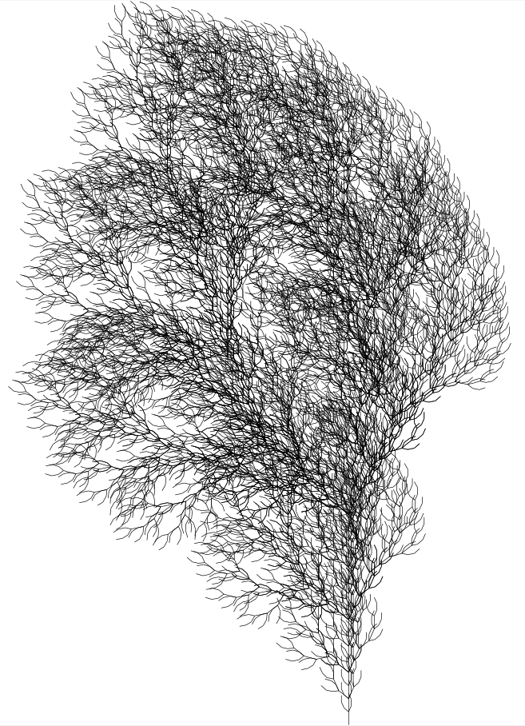

# CUDA L-system
This work is focused on extends the classic L-system formalism through the use of the GPU enabling concurrent execution of its components.

## L-system formalism
An L-system is a rewriting string system which is composed of two phases, derivation and interpretation. This kind of system can be defined as a tuple G = (Σ, θ, Π) where:

* __Σ__  represents the set of symbol of the L-system.
* __θ__  represents the starting string.
* __Π__  represents the production rules which describes how a symbols has to be rewritten

An example of an L-system can be the following:

* __Σ__ = (A, B)
* θ = A
* Π = (A → AB, B → BA)

While the execution of the derivation phase produces:

* __Iteration 0: A__
* __Iteration 1: AB__
* __Iteration 2: ABBBA__
* __Iteration 3: ABBBABBAABBBA...__

And the result of the interpretation phase can be:



## Project goal
In this project, you'll discover an implementation of the traditional L-system, alongside an L-system executed using GPU acceleration through CUDA. To run the parallel implementation, an NVIDIA GPU is required. More details can be found in the [document](Document/Parallel_L_System.pdf) inside the repository.

This implementation supports only context-free and deterministic L-systems.

## Usage
The implementation already has standard meaning for certain symbols which are:

| Symbol | Meaning|
|--------|--------|
| A | Draw|
| B | Draw|
| F | Draw|
| G | Draw|
| b | Move|
| [ | Push|
| ] | Pop |
| - | Turn left|
| + | Turn right|


The first thing to do is to import the header file like the following:
```c++ 
#include "../L-system/lsystem.h"
```

this can change according to the position of the file inside the project.

Then it is possible to create an L-system:
```c++ 
lsystem lsystem(options)
```
`options` must contains:

* `axiom` A string representing the initial axiom.
* `rules` A string representing one or more rules like "X F+[[X]-X]-F[-FX]+X F FF".

At this stage it is possible to change or add a way on how a symbol will be interpreted, using the following method:
```c++ 
lsystem.setMeaning(options)
```
`options` must contains:
* `symbol` A string representing the symbol for which you want to add a meaning.
* `meaning` An int representing a meaning to give to the symbol specified. It is advisable to use the symbolMeaning enumeration inside the lsystem class.

Then it is possible to execute the L-system with the following ways:
```c++ 
lsystem.execute(int iterations);
lsystem.executeOnGPU(int iterations);
lsystem.executeOnGPUWithModules(int iterations, int modulesLenght);
```

The initial two lines allow for the execution of the L-system using either the CPU or GPU. It's important to note that for GPU execution, an NVIDIA GPU and the CUDA development kit are needed.

The second and third lines exhibit variations due to the employment of distinct algorithms for result computation. It is recommended to opt for the method that requires the utilization of modules, with the parameter specifying the number of symbols per module. In order to understand better refers to the [document](Document/Parallel_L_System.pdf).

It is possible to write the result string to a file using:
```c++ 
lsystem.write(options)
```
`options` contains:
* `name` A string which represents the name of the file.
* `write gpu result` A boolean value which is an optional parameter in order to specify if you want to write the gpu result instead the cpu one. The default value is `false`.

At the end it is possible to draw the results:
```c++ 
lsystem.draw(options)
```
`options` contains:
* `name` A string representing the name of the file.
* `turn angle` A double representing an angle expressed in `degree` which specify the rotation amount when the turtle has to rotate itself.
* `step length` A double representing the length of the segment drawn.
* `draw gpu result` A boolean value which represent the choice to draw the gpu result instead of the cpu one. The default value is `false`.
* `starting direction` An int which represent the initial orientation of the turtle, so in which direction it starts drawing. It is advisable to use the direction specified inside the class like:
	```c++ 
	lsystem::UP
	lsystem::DOWN
	lsystem::RIGHT
	lsystem::LEFT
	```

An example of execution is:

```c++ 
#include "../L-system/lsystem.h"

int main(int argc, char const *argv[])
{
    // Barnsley fern
    lsystem barnsley("X", "X F+[[X]-X]-F[-FX]+X F FF");
    barnsley.execute(7);
    barnsley.executeOnGPUWithModules(7, 3);
    barnsley.write("Barnsley Fern", true);
    barnsley.draw("Barnsley Fern", 25, 10, true, lsystem::UP);

    return 0;
}
```

The above one represents the Barnsley fern L-system whose result can be seen in the L-system formalism paragraph.


